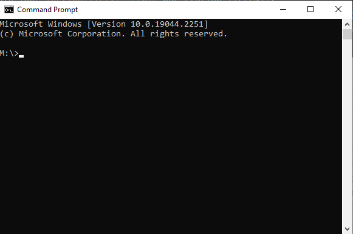

# OS Environment Variables Settings 系統環境變數設定

### For Windows

1. 按 Win + i 打開系統設定

2. 選擇 System 系統功能

3. 選擇 About 關於，將界面拉寬一點，右側會出現進階設定并點擊

4. 選擇 Environment variable 環境變數

5. 選擇用戶欄中的 Path 路徑，然後點擊 Edit 編輯

6. 右上角選擇 New 新增，然後貼上路徑

7. 所有彈出來的窗口都點擊確認即可

### 環境檢查

- 1. 按 Win + r 打開運行界面

- 2. 輸入 cmd.exe 後，會彈出黑色的命令行界面

- 3. 在命令行界面輸入以下對應想要檢查的程式語言指令
( *注：如果環境配置成功，會顯示版本號，例如：version7.11.12 )
( *注：失敗這會顯示，非内部命令 或出現 Internal 字詞，這時候請重新檢查路徑是否正確 )
#### C語言
|程式語言 |指令
|:----   |:----
| C      | gcc -v
| C++    | g++ -v

- C語言環境檢查成功範例

- 環境檢查失敗
